# DishCover

<h2>Welcome</h2>

Link to live website: [CLICK HERE!](https://dishcover-c2716dc71705.herokuapp.com/)

# Introduction

## Dishcover

Welcome to [**Dishcover**](https://dishcover-c2716dc71705.herokuapp.com/), your ultimate destination for culinary exploration and creativity. Our platform is designed to bring together food lovers from all walks of life to discover, create, and share extraordinary recipes. Whether you're an aspiring chef or a passionate home cook, Dishcover is here to inspire your culinary journey.

At [**Dishcover**](https://dishcover-c2716dc71705.herokuapp.com/), we believe that every dish has a story waiting to be told. Our goal is to create a welcoming community where you can uncover new flavors, perfect your cooking skills, and connect with fellow food enthusiasts. From mouthwatering recipes to expert tips and tricks, we provide everything you need to elevate your cooking experience.

Join us as we embark on a delicious adventure, explore diverse cuisines, and celebrate the art of cooking together. Discover new favorites, share your own creations, and make every meal a memorable one with Dishcover.

# Table of Contents
final addition !.
.
.
.

# UX - User Experience

Dishcover is designed with a focus on delivering an engaging and immersive experience for food enthusiasts. Our user experience is crafted to enhance exploration, interaction, and personalization within the world of culinary arts. Here’s a breakdown of our user experience:

- **Intuitive Navigation:** Our user-friendly interface simplifies the exploration of recipes and cooking tips, ensuring that users can effortlessly find and enjoy the content they’re interested in.

- **Responsive Design:** No matter if you’re using Dishcover on a desktop, tablet, or mobile device, our responsive design guarantees a seamless and consistent experience across all platforms, enabling you to enjoy your favorite recipes and culinary content wherever and whenever you want.

- **Personalization:** Users can create personalized profiles to save their favorite recipes, and creat their own collection of recipes. This feature helps tailor the platform to each user's unique interests and preferences.

- **Interactive Community:** Dishcover cultivates a lively community where users can share their culinary passion, exchange ideas, and engage through likes and personal reviews of recipes and food experiences to connect with like-minded individuals.

Dishcover’s UX design strives to create a dynamic and inclusive space where food enthusiasts can explore, learn, and connect, while immersing themselves in the diverse and delightful experiences of the culinary world.

# Project Scope

### Purpose and Goal

Dishcover aims to be the ultimate online blog for food enthusiasts, offering a dynamic platform where users can explore, share, and connect over culinary experiences. It provides a rich resource for discovering recipes, reviewing dishes, and engaging with a passionate community. The goal is to foster a vibrant environment where users can exchange ideas, access diverse food content, and enjoy personalized features.

### Target Audience:

- ***Home Cooks:*** Individuals seeking inspiration and new recipes for everyday cooking.
- ***Aspiring Chefs:*** Those interested in expanding their culinary skills and knowledge.
- ***Culinary Aficionados:*** Enthusiasts passionate about exploring diverse food experiences and trends.
- ***Food Reviewers:*** Users looking to share detailed reviews and feedback on recipes.

### User needs 

- Easy access to a wide variety of recipes to inspire and assist with meal planning.
- Resources and tips to enhance cooking techniques and knowledge.
- Features to save favorite recipes.
- Features to filter and easily discover user recommendations.
- Accurate and detailed recipe instructions, ingredient lists, and cooking tips.
- Option to rate recipes to help others make informed choices.

### Features

- Extensive collection of diverse recipes, including detailed descriptions and user ratings.
- User registration for personalized features.
- Ability for users to rate recipes.
- Content mamagement system for admins to create, delete, and update posts.
- Interactive features and forms.
- Advanced search and filter capabilities to quickly find specific recipes.

# Design

## Colour Scheme

Dishcover’s color scheme is thoughtfully designed to evoke warmth, sophistication, and a sense of culinary adventure. Each color has been selected to contribute to an inviting and engaging user experience.

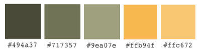

- **#494a37 -  earthy green-brown:** Used as a font color, it provides a strong contrast against lighter backgrounds, ensuring readability while imparting a grounded, natural feel. 
- **#717357 - muted olive green:** It creates a visually appealing contrast that guides users effortlessly through the site.
- **#9ea07e - lighter olive green:** Used in forms and various elements, the color's subtlety makes it ideal for background elements, contributing to a clean, user-friendly interface that is both pleasing and unobtrusive.
- **#ffc674 golden yellow shade:** The color’s brightness draws attention and encourages interaction, while still maintaining a sophisticated edge.
- **#ffb94f deeper shade of golden yellow:** The color’s warmth and intensity create a more immersive and engaging user interaction.
- #faf4c1 (continue)...
- #ffffff (continue)...

## Fonts
.
.
.
.

# Project Planning

## Agile Development

Dishcover was developed using Agile methodology, allowing for iterative and flexible development throughout the project. By utilizing GitHub Projects and Issues, the development process was efficiently managed through a Kanban-style board. Each part of the app was divided into Epics, which were then broken down into user stories and tasks, enabling continuous progress tracking and timely delivery of functionality. This approach ensured that changes could be easily incorporated, leading to a refined and user-centered final product

- An **Epic** is a large feature or objective that’s too big to complete in one go. It’s broken down into User Stories, which are smaller, actionable pieces of functionality. The epics can be viewed on this project's [Kanban board](https://github.com/users/Ahmadk-g/projects/4).

- **User Stories** are brief descriptions of a feature from an epic from the user's perspective. They define what the user needs and include acceptance criteria that detail the requirements for completion. Each user story usually consists of several tasks necessary to meet the user’s needs. The user stories are introduced as issues and can be found [here](https://github.com/Ahmadk-g/dishcover/issues)

### MoSCoW Prioritization

- Is a method for ranking user stories based on their importance: Must Have, Should Have, Could Have, and Won't Have. This approach helps prioritize features and tasks, ensuring critical user stories are completed first, while less crucial ones are addressed later.

### Kanban board

- A visual tool in agile project management. It visually represents the workflow stages and the status of individual user stories. 

The Kanban board for this project can be viewed [here](https://github.com/users/Ahmadk-g/projects/4).

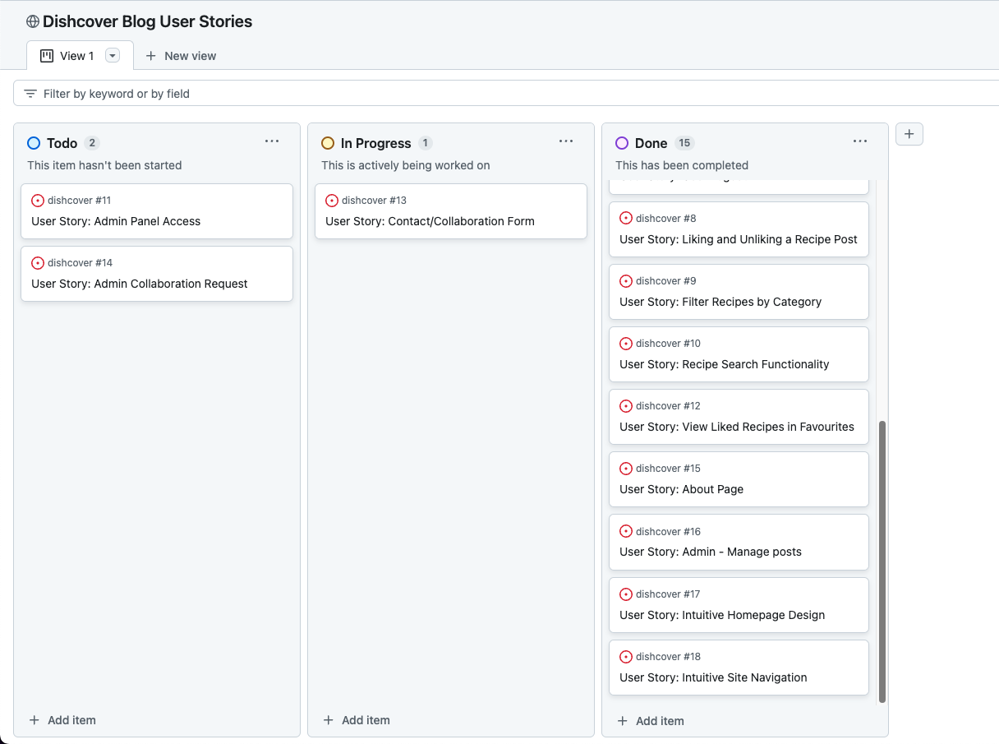

## Site Layout Design

***Home Page***
- Welcome message
- Recipe search functionality
- Quick links to Recipes, Add Recipe, and Contact/About pages

***Recipes Page***
- Category based filter
- Link to add new recipe
- Paginated recipe list view
- Links to detailed view of every single recipe

***Detailed Recipe Page***
- Picture of Recipe
- title and main info for recipe
- likes and CRUD functional buttons(for if the author is the current user)
- like and unlike button
- detailed ingredients and instructions

***Add Recipe Page/Form***
- Create new recipe form

***About & Contact Page***
- Information about the website and purpose of people behind it
- Contact/Collabortation form

***Register, login & logout pages***
- User registration form
- User sign-in form
- User sign-out form

***Navigation***
- Primary Navigation: Links to Recipes pages, about/contact page, Add recipe page, and Admin panel (for superusers)
- Unregistered users: Addition Log-in and Register pages
- Refistered users: Link to user favorites and User's recipes
- Footer Navigation: Links to social media

***Interaction Design***
- Responsive design for optimal viewing across devices
- Intuative navigation 
- Interactive elements 

## Wireframes

**Mobile and Desktop**

#### Home Page Wireframes

Click to View Home Page wireframes

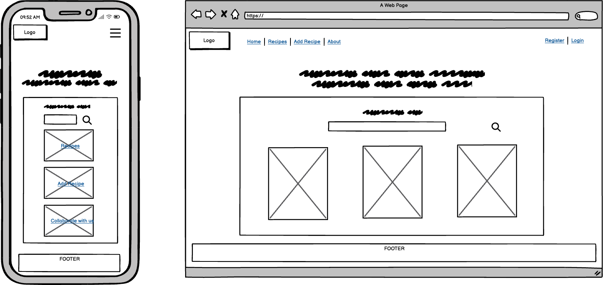

#### Recipes Page Wireframes

Click to View Recipes Page wireframes

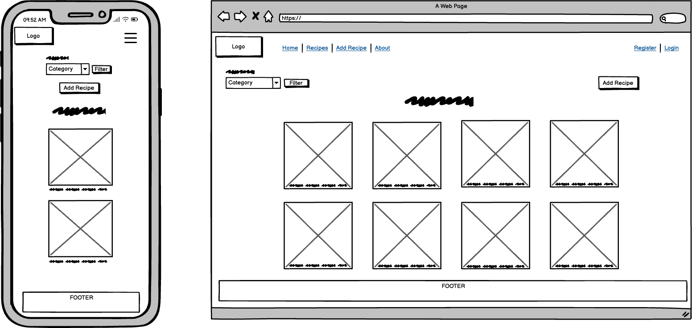

#### Recipe Details Page Wireframes

Click to View Recipes Details Page wireframes

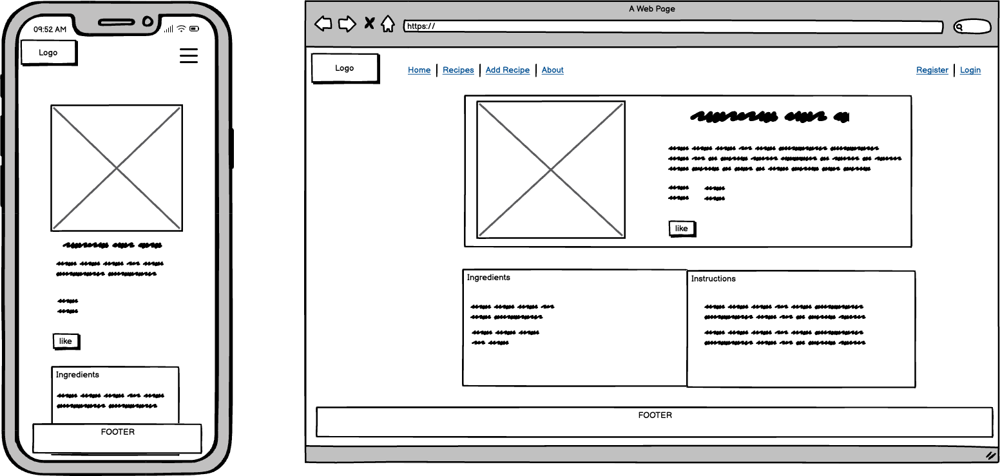

#### My Recipes / Favorites Page Wireframes

Click to View My Recipes/Favorites Page wireframes

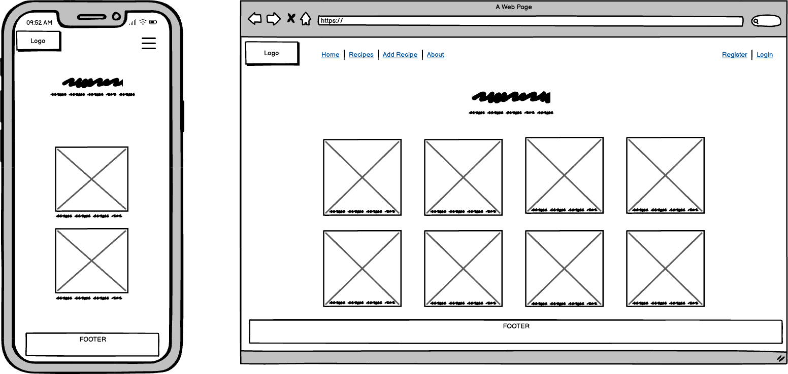

#### Add/Edit Recipe Page Wireframes

Click to View Add Recipe Page wireframes

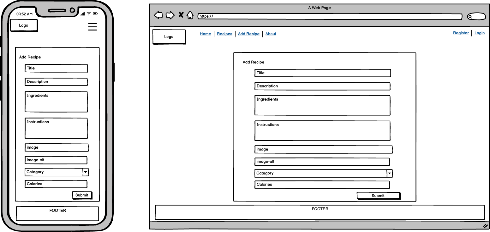

#### About Page Wireframes

Click to View About Page wireframes

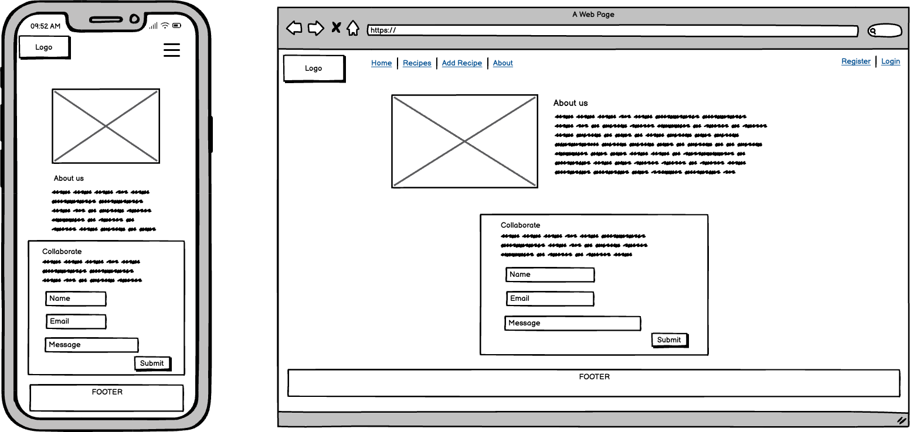

## Database Schema - Entity Relationship Diagram (ERD)

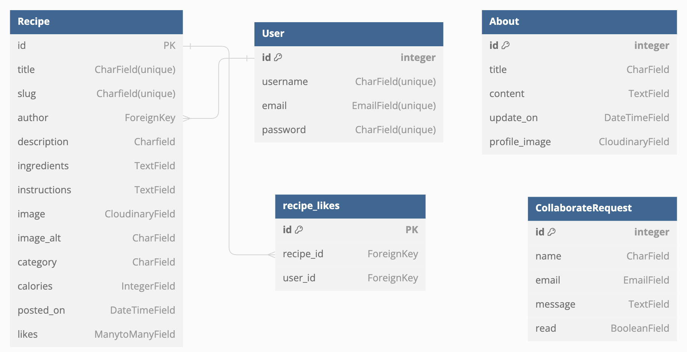

An Entity-Relationship Diagram (ERD) visually represents the structure of the project's PostgreSQL database, showing how different tables (entities) relate to one another. The ERD maps out relationships like the one-to-many connection between users and recipes (a user can create multiple recipes). This diagram is essential for understanding the database schema and ensuring that relationships within the application are correctly implemented.

## Security

Dishcover prioritizes data security by implementing strict measures to protect user information. Only authorized users can access or alter sensitive data, and the platform is designed to prevent security vulnerabilities. CSRF protection is also in place to prevent unauthorized actions. Our commitment is to ensure user privacy and keep all data secure.

**Authentication and Authorization:**
- Easy account creation and login with Django Allauth.

**CRUD Functionality:**
- Django's class-based views handle viewing, editing, and deleting tasks.
- Only authorized users xan modify data using authentication tools.
- Mixins like 'LoginRequiredMixin' and 'UserPassesTestMixin' ensure security by restricting actions to logged-in users.

**Environment Security:**
- Sensitive info stored in .env file during development.
- Uses environment variables in production for added security.
- Disables debug mode in production to enhance protection.

**CSRF Protection:**
- Uses CSRF tokens to prevent malicious actions.
- Ensures forms are secure by verifying authenticity with every submission.

# Features

### Logo

The logo is not just a visual element but also a functional feature. Clicking on it will always bring you back to the homepage, providing an easy way to navigate to the starting point of the site.

Click to View Logo

### Navigation Bar

The dynamic navbar adjusts based on user status. When logged in, it replaces the register and sign-in options with personalized features and a logout button. Superusers see additional links for quick access to the admin panel.

<strong>Click to View Navbar</strong>

**Not Logged In:**  

**User Authenticated:**     
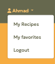

**Super User:**   

 
On smaller screens, the navbar compresses into a dropdown for easier navigation.
 
 

<strong>Click to View Hamburger Menu</strong>

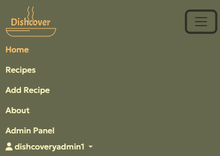

### Home Page

Dishcover's homepage welcomes the user with an intuituve layout, featuring a motivational message, a search bar for quick recipe discovery, and straightforward links to key sections of the site.

<strong>Click to View Home Page</strong>

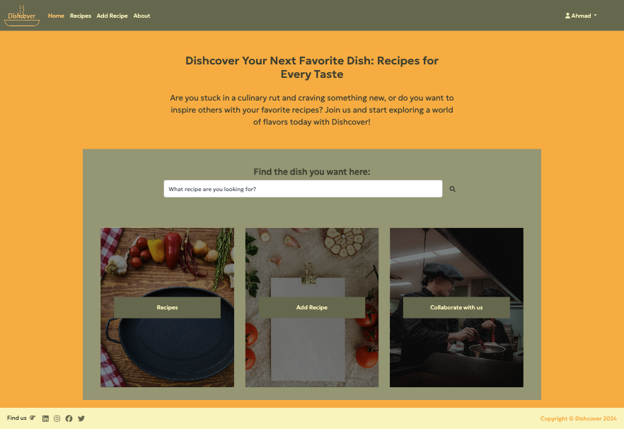

### Recipes Page

The Recipes page displays a paginated list of all recipes, allowing users to easily browse through them. It features filters to sort recipes by meal type and includes a link to create a new recipe, enhancing both navigation and user interaction.

<strong>Click to View Recipes</strong>

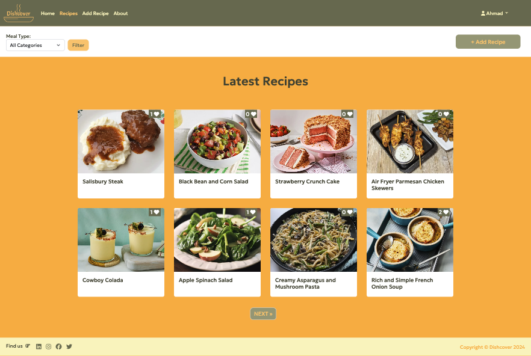

### Recipe Details View

The Recipe Details view offers an in-depth view of each dish, showcasing a featured image, essential recipe information, and detailed instructions. Users can also interact with the recipe through likes, and for authors, options to edit or delete the recipe are available.

<strong>Click to View Recipes Details</strong>

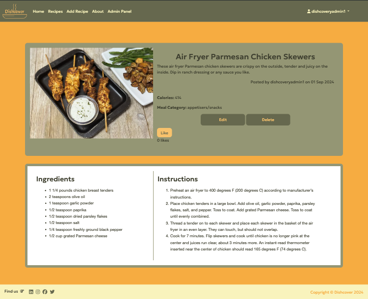

### Add Recipe Page

The Add Recipe page allows users to easily create and share their own recipes by filling out a simple form with all the necessary details.

<strong>Click to View the Add Recipes Page</strong>

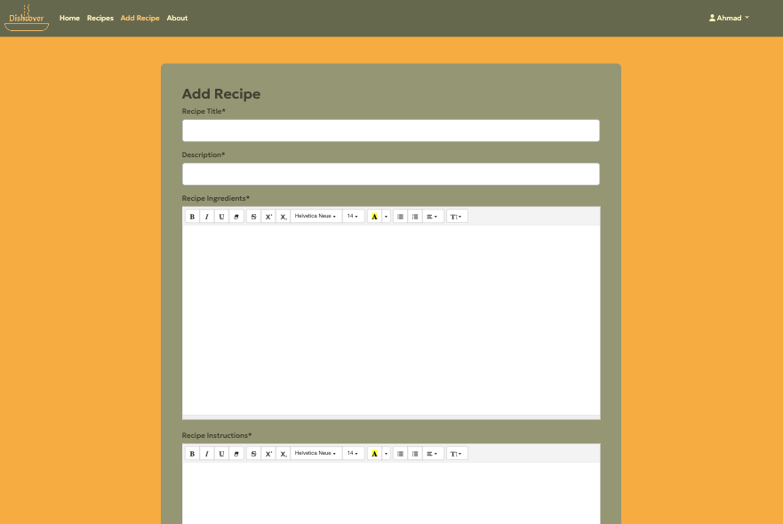

### Delete Recipe Confirmation Page

The Delete Recipe Confirmation page prompts users to confirm the removal of a recipe. It clearly displays the recipe's title, ensuring users are aware of what they are about to delete, with options to either proceed with the deletion or cancel the action.

<strong>Click to View Delete Confirmation Page</strong>

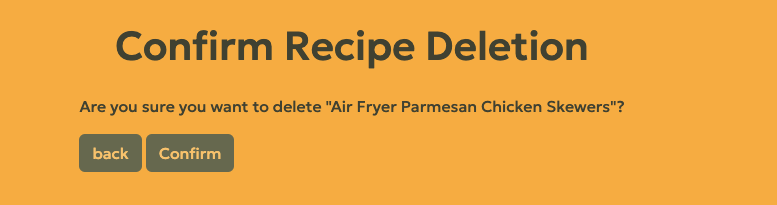

### About

The About page provides an overview of Dishcover, detailing the website's mission. It also offers insights into the team behind the platform and includes a form for users to reach out for collaborations or inquiries.

<strong>Click to View the About Page</strong>

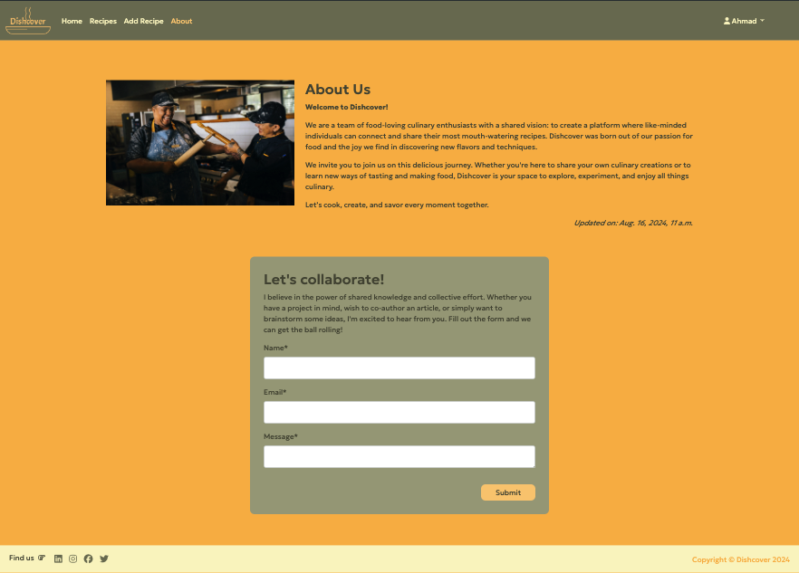

## User Tailored Features

### My Recipes Page

The My Recipes page displays all the recipes a user has created, allowing easy access to edit or delete them. It provides a personalized space for users to manage their culinary creations efficiently.

<strong>Click to View 'My Recipes' Page</strong>

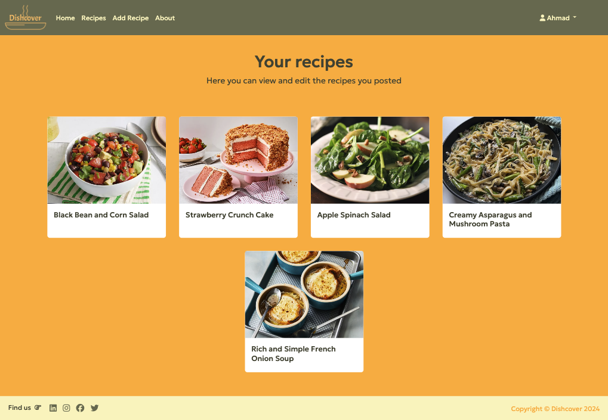

### Favorites Page

The My Favorites page showcases a personalized collection of recipes that a user has liked, making it easy to revisit and enjoy their top culinary picks anytime.

<strong>Click to View 'Favorites' Page</strong>

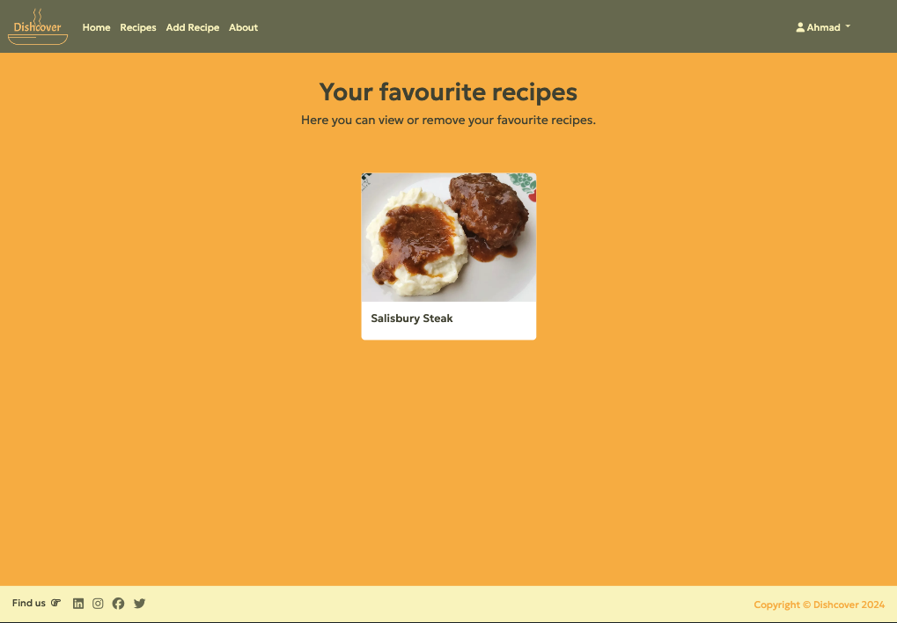

 
If the user hasn't liked any recipes, they get a different view. Same case for 'My Recipes'.

<strong>Click to View 'Message' </strong>

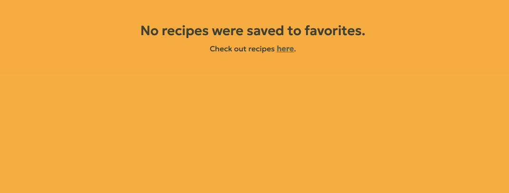

### Authentication Pages

The authentication pages on Dishcover include login, signup, and logout. The _login_ page lets users securely access their accounts by entering their credentials, while the _signup_ page allows new users to join quickly by provideing necessary information. The _logout_ function ensures safe and easy account exit, protecting user information.

<strong>Click to View 'Login' Page</strong>

